# ChatLoop — MERN Real-Time Chat Application

<div align="center">


A real-time MERN stack chat application with authentication, one-on-one messaging, image sharing, AI chatbot support, email verification, and offline notifications.

</div>

---

## Screenshots

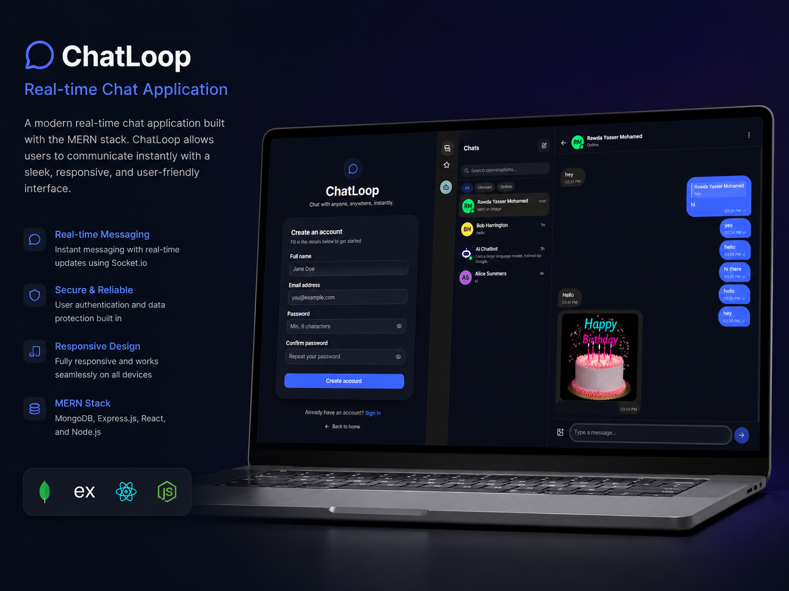

### Authentication

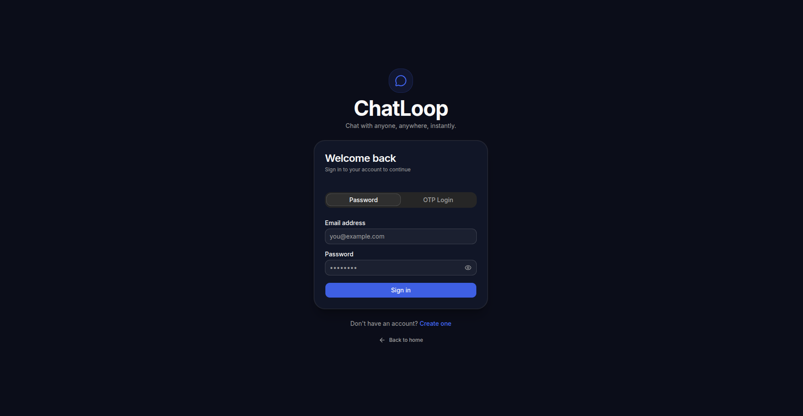
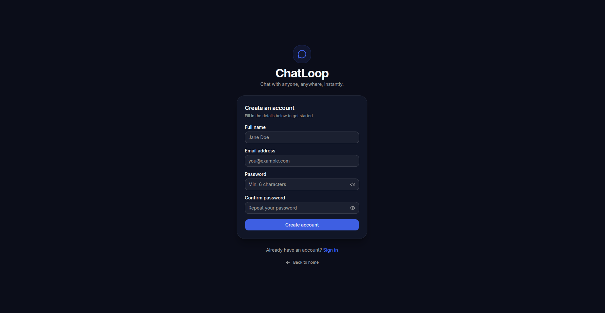

### Chat Experience

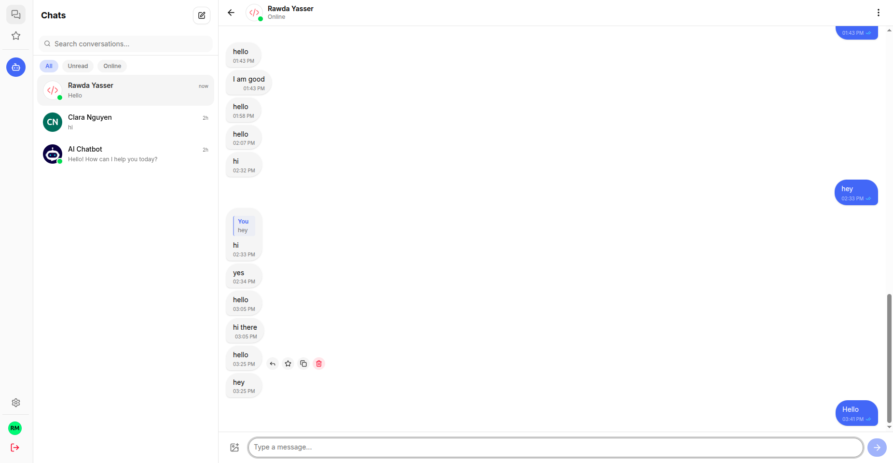
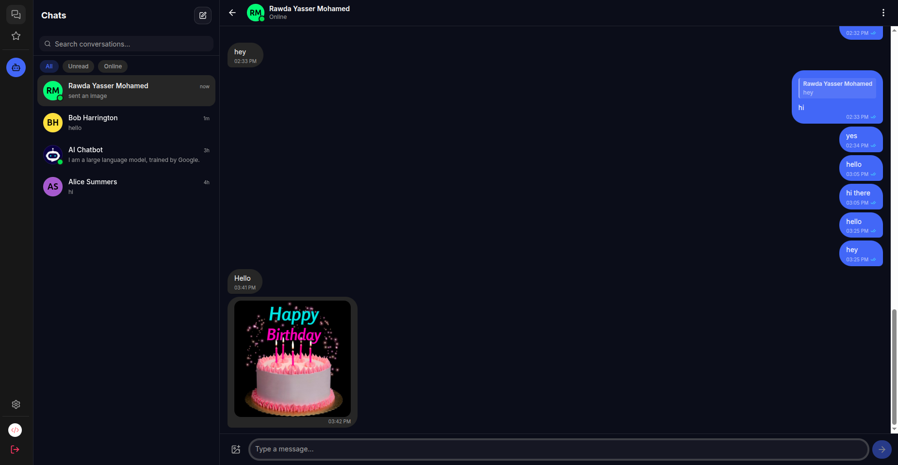
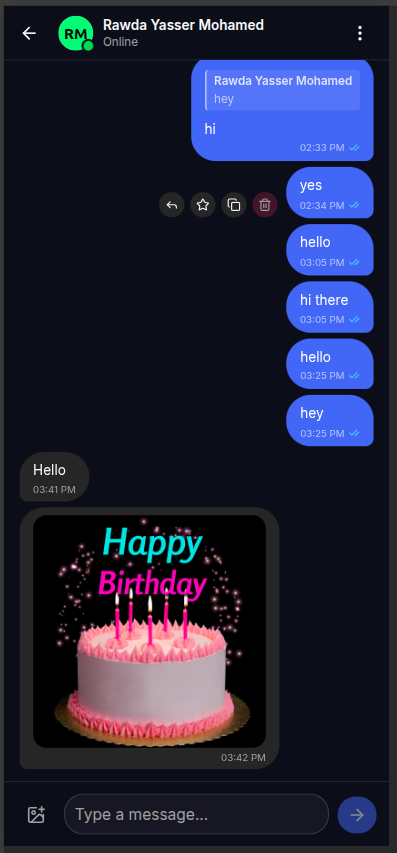

### AI Chatbot

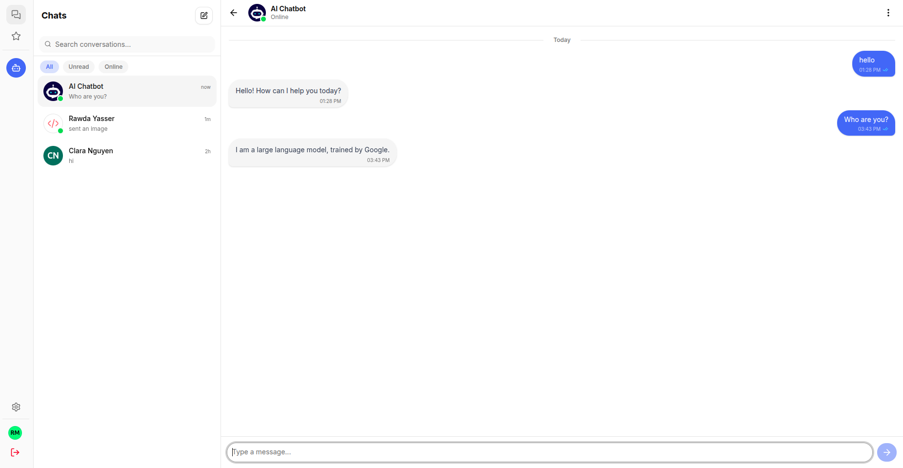
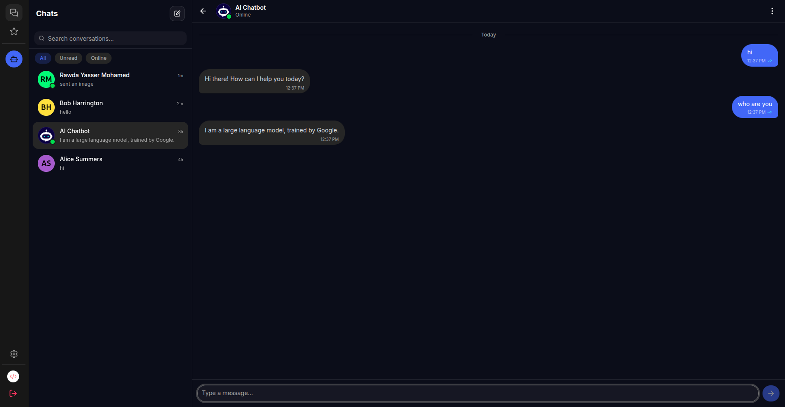

### Media & Profile

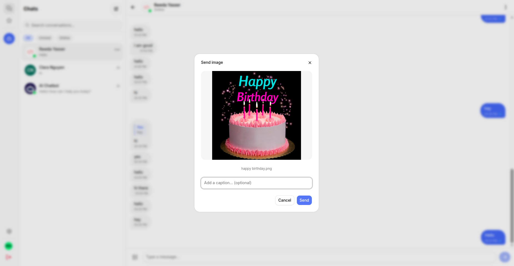
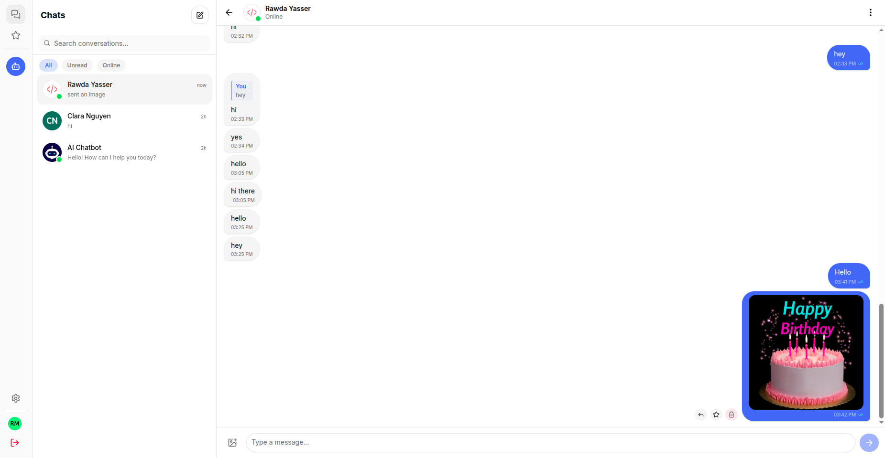
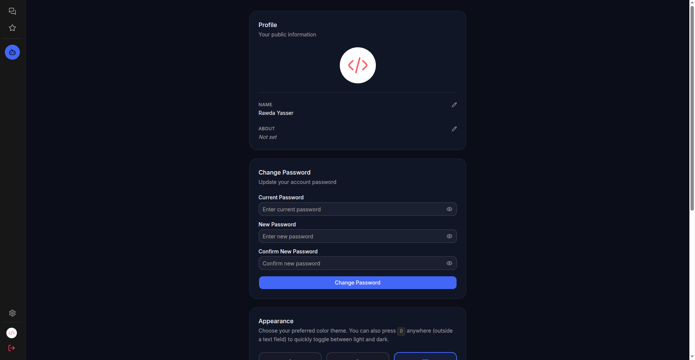

## Features

- Email/password authentication with JWT
- OTP login and email verification
- Real-time messaging with Socket.IO
- Text, image, reply, delete, clear chat, and starred messages
- Online/offline status, typing indicators, seen receipts, unread counts
- AI chatbot powered by Google Gemini with streaming responses
- Profile management and password updates
- Block/unblock users
- Email notifications for offline users
- Dark/light theme and responsive UI
- Docker support for easy setup

## Tech Stack

**Frontend:** React, TypeScript, Vite, Tailwind CSS, shadcn/ui
**Backend:** Node.js, Express.js
**Database:** MongoDB, Mongoose
**Real-time:** Socket.IO
**Auth:** JWT, bcrypt
**AI:** Google Gemini
**Email:** Nodemailer / Gmail SMTP
**Storage:** Cloudinary / S3
**Deployment:** Docker, Docker Compose

## Project Structure

```bash
ChatLoop/
├── backend/
│   ├── Controllers/
│   ├── Models/
│   ├── Routes/
│   ├── socket/
│   ├── middleware/
│   ├── utils/
│   └── index.js
│
├── frontend/
│   ├── src/
│   │   ├── pages/
│   │   ├── components/
│   │   ├── context/
│   │   ├── hooks/
│   │   └── lib/
│
├── docker-compose.yml
└── .env.example
```

## Environment Variables

Create a `.env` file from `.env.example` and add:

```env
MONGO_URI=
MONGO_DB_NAME=
JWT_SECRET=

GEMINI_API_KEY=
GEMINI_MODEL=

EMAIL=
PASSWORD=

CORS_ORIGIN=
FRONTEND_URL=
VITE_API_URL=
```

## Getting Started

### Docker

```bash
git clone https://github.com/your-username/ChatLoop.git
cd ChatLoop
cp .env.example .env
docker compose up --build -d
```

Frontend: `http://localhost`
Backend: `http://localhost:5500`

### Manual Setup

```bash
cd backend
npm install
npm run dev
```

```bash
cd frontend
npm install
npm run dev
```

## Main API Routes

```bash
/auth
/conversation
/message
/user
```

Protected routes require:

```bash
auth-token: <JWT>
```

## Socket.IO

The app uses Socket.IO for:

- Sending and receiving messages
- Typing indicators
- Online/offline presence
- Seen receipts
- AI streaming responses
- Real-time notifications

Socket connections are authenticated using JWT.

## Security

- Passwords and OTPs are hashed with bcrypt
- JWT is required for protected REST routes and sockets
- Server validates conversation membership
- Client-supplied user IDs are not trusted
- Blocked users cannot send messages
- Deleted accounts are anonymized

## License

MIT
